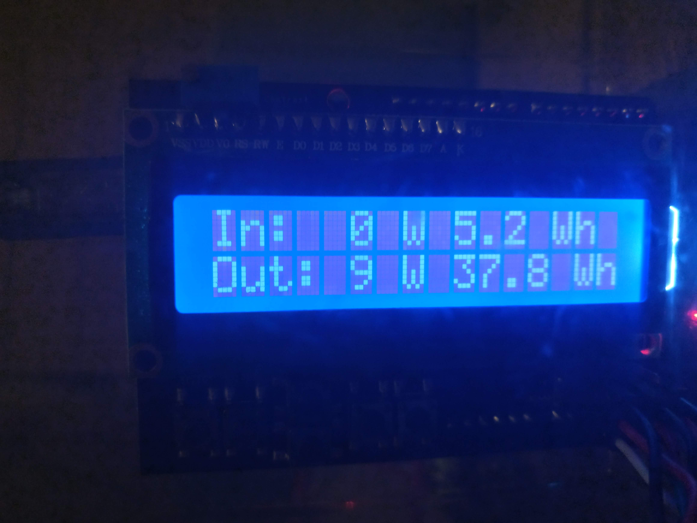
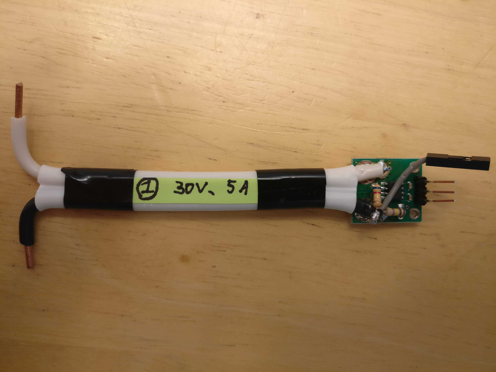

# power_meter

## Hardware and software for a simple Arduino-based power meter intended for solar measuring applications.

Uses DC voltage and current sensors to measure power for both input (ex. from a solar panel) and output (whatever the load is). Power usage over time is totaled into energy (Wh). A 2 row LCD display allows showing the data. This allows both tracking instantaneous usage as well as how much more energy has been produced than used (or not!).

### Hardware

* LCD shield simply mounts onto the Arduino Uno
* Current sensors connect to the front of the LCD shield
* To sense voltage, a resistor divider can be incorporated into the current sensor as per pictures in [hardware/rev1/pictures](hardware/rev1/pictures) and hooked up to it's own analog input. This means the current sensor must be connected in-line on the positive side and that the system's ground must be connected to the Arduino's ground (such as by powering it from the system).

### Software

#### Setup

On Ubuntu, do:
`sudo apt-get install arduino-mk`

To flash the arduino, do:
`make upload`

## Usage

* Up and down on the LCD shield control the brightness
* Left and right switch between the different screens (summary, in, and out)
* Reset just resets the Arduino which clears the energy counter.
* Select doesn't do anything.