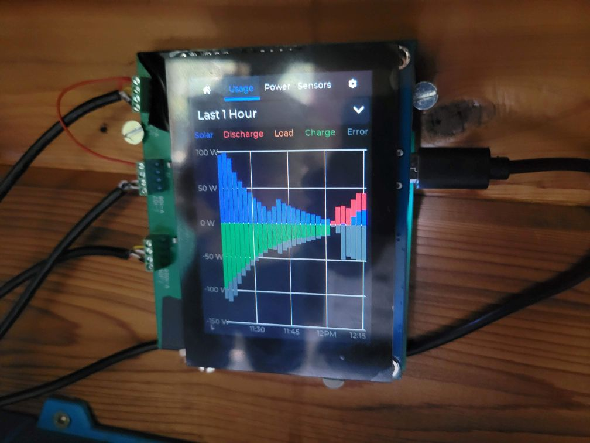
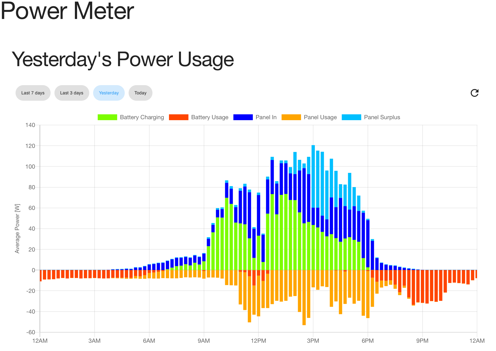

# power_meter

## Hardware and software for a simple power meter intended for solar measuring applications.

Uses DC voltage and current sensors to measure power for both input (ex. from a solar panel) and output (whatever the load is). Power usage over time is totaled into energy (Wh). Multiple versions of the hardware and software exist, with differing features. See the README in each directory for details.

## esp32-viewe:

## esp32-micropython:

## arduino-lcd:

