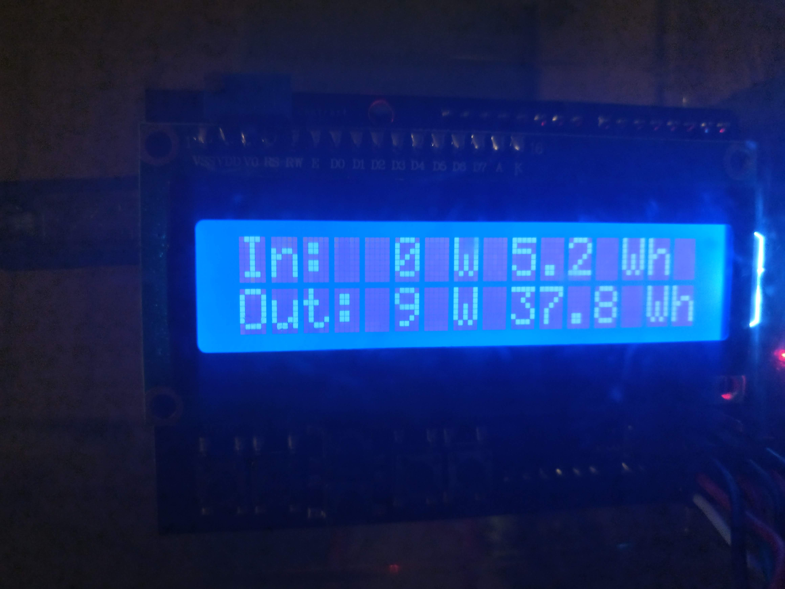
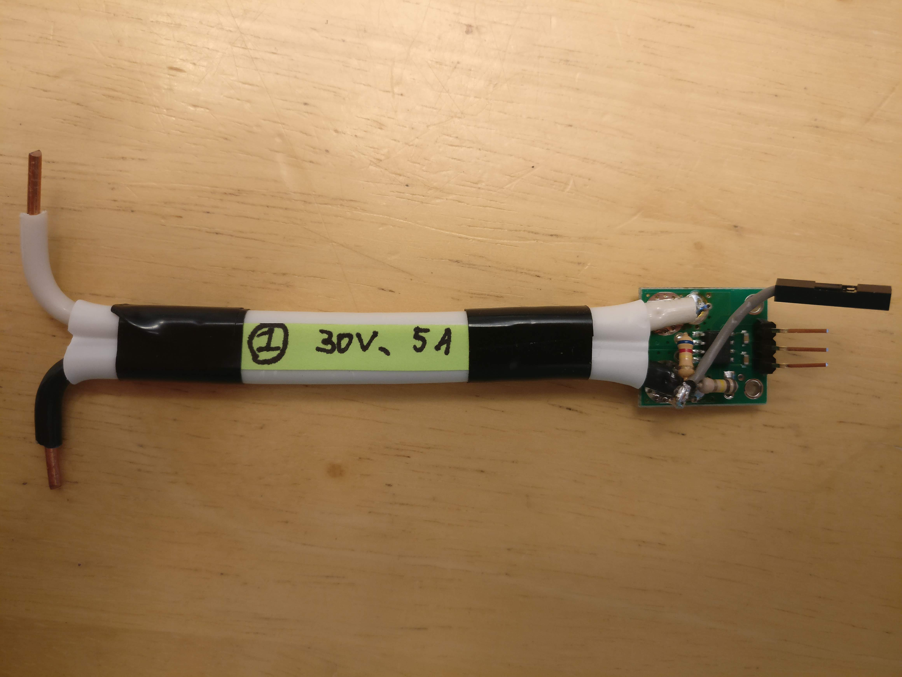

# power-meter arduino-lcd

## Software for a simple Arduino-based power meter with a 2 row LCD.

A 2 row LCD display allows showing the data. This allows both tracking instantaneous usage as well as how much more energy has been produced than used (or not!).



### Hardware

* LCD shield simply mounts onto the Arduino Uno
* Current sensors connect to the front of the LCD shield
* To sense voltage, a resistor divider can be incorporated into the current sensor as per pictures in [hardware/rev1/pictures](hardware/rev1/pictures) and hooked up to it's own analog input. This means the current sensor must be connected in-line on the positive side and that the system's ground must be connected to the Arduino's ground (such as by powering it from the system).



### Software

#### Setup

The primary build uses [PlatformIO](https://platformio.org/):

```sh
pio run -e uno
pio run -e uno --target upload
```

The existing Arduino-Makefile workflow remains available for compatibility. On
Ubuntu, install it with `sudo apt-get install arduino-mk`, then use
`make upload` as before.

Run the PM1 checksum and formatting tests locally, without an attached Uno:

```sh
pio test -e native
```

The generic wire contract and current Uno-to-ESP32 wiring are documented in
[`esp32-viewe/docs/UART_SENSOR.md`](../esp32-viewe/docs/UART_SENSOR.md).

## Usage

See [manual.md](manual.md)
