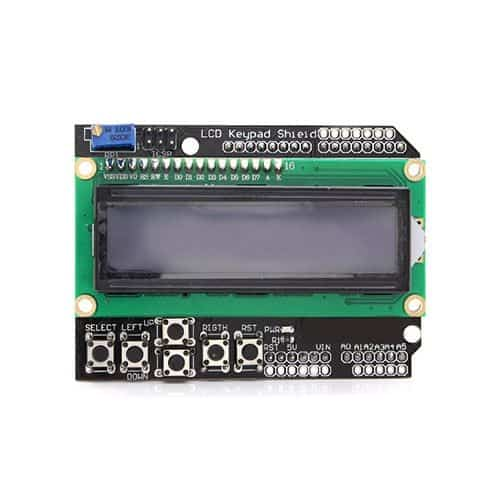

# power-meter arduino-lcd Manual

This is the guide on how to use the meter: how to interpret what is displayed and what the buttons do.

## General Principals

The meter is constantly taking measurements in the background and keeping a total of energy usage. The meter is stateful and can save data that persists between power loss or restarts. Energy data is only saved every 15 minutes, so some recent power measurements won't be saved on an unexpected restart.

The meter shows one of a few difference screens and you can navigate between screens using the left and right arrow buttons. Within each screen, you can perform different actions using a combination of the select button and arrow buttons (up/down and left/right).

The select button is used to make changes. You can navigate around using arrows without fear of changing anything. After pressing select once and changing something, you'll need to confirm the change before it's actually applied.

The meter measures power coming in from the solar panel (In) and power coming out of the system to power loads such as lights (Out). It does not directly measure battery capacity, but rather tries to infer it by adding up the power over time.

When the battery is nearing full charge, the speed at which it is charged has to slow down. In order to achieve this, the charge controller enters what's called PWM mode (pulse width modulation) which results in not all of the energy available at the panel being used: there's nowhere to put it. The meter can detect when this is occuring and indicate what percent of the available power is actually being used.

## Buttons

There are six black buttons in the bottom left corner.

SELECT, LEFT, UP, DOWN, RIGHT, and RST (reset)

The reset button (RST) is hardwired in to power cycling the meter. Does the same things as unplugging and then plugging back in.

The LEFT and RIGHT buttons navigate between pages. Some pages support pressing SELECT to perform actions. More details below.

Buttons must be pressed and released. No press and hold or double-click behaviour going on here.

## Pages

There are 7 pages. In order:
* Summary - shows most important power and energy numbers.
* Energy - shows total energy in and out.
* In - shows readings specific to the solar panel (In).
* Out - shows readings specific to the load (Out).
* Bat - shows experimental battery level estimations.
* Debug - shows low-level troubleshooting information.
* Time - allows for setting and then viewing of the time. Time isn't used for anything yet.

Details are provided for each page using sample numbers:

### Summary
    |Sun 100W In   50W|
    |Out  10W    123Wh|

__Sun__ is the power available at the solar panel.

__In__ is the power actually comming out of the solar panel. May be less than the available power when the battery is nearly charged and the control enters PWM mode. 

__Out__ is the power being used by devices.

The fourth number in the bottom right, in units of Wh, is the net power since last reset. This is the total power in minus the total power out. If this is negative, that means energy has been drawn from the battery and it hasn't been charged back up yet. Due to efficiency reasons, 0 Wh doesn't mean that the battery is fully charged: more energy will have to be put into the battery than was taken out to actually get it to 100% capacity. On the order of 20% more energy.

__SELECT__: you can press SELECT on this page to reset the total power usage to 0. This is handy to do when you know the battery is fully charged, or on a regular cadence (ex. daily) to know when you're starting point is. 

After pressing SELECT, a confirmation page shows up, press LEFT or RIGHT to pick yes or no and then SELECT again to confirm.

__UP/DOWN__: you can press the UP or DOWN buttons to adjust the LCD brightness.

### Energy
    |In         323Wh|
    |Out        200Wh|

__In__ is the total energy from the solar panel since last reset.

__Out__ is the total energy consumed since last reset.

__SELECT__: you can reset the energy just like on the Summary page. See above.

### In
    |In   50W   323Wh| 
    |  2.8 A  18.12 V| 

or

    |In   50W PWM 50%| 
    |  2.8 A  18.12 V| 

__In__ is the actual power coming in from the panel.

The top right number can be one of two things. If PWM mode is engaged, it shows "PWM" and what percentage of the available power is actually coming in. I.e. 50 W and 50% means there's actually 100W available, but nowhere to put it: good time to charge device batteries. If PWM mode isn't engaged, it shows the total energy in, same as the energy page.

The bottom left number is the current in amps.

The bottom right number is the voltage in volts.

__SELECT__: the select button can be used to enter calibration mode for this sensor. Press the left or right arrows to pick "yes" or "no". "no" goes back out without doing anything, "ye"s" fully enters calibration mode. For details on calibration, see the Calibration section below.

### Out
    |Out  10W   123Wh| 
    |  0.7 A  13.71 V| 

Same as the In page, but for the output sensor.

__Out__ is the power being used by devices.

The __Wh__ number in the top right is the total energy measured since last reset.

The bottom left number is the current in amps.

The bottom right number is the voltage in volts. This is effectively the battery voltage although note that it's affected by charging and load: when the battery is being charged, the voltage measured will be high.

__SELECT__: the select button can be used to enter calibration mode for this sensor. For details on calibration, see the Calibration section below.

### Bat
    |Bat 2200/2500 Wh|
    |-50<->150Wh 88% |

This is a pretty experimental page.

__2500__ is the hardcoded theoretical battery capacity in watt-hours (Wh).

__2200__ (in this example) is the estimate current battery charge level, also in watt-hours.

When the energy totals are reset, the meter assumes the battery is at 100% charge and then tracks deviations from that. If the battery is charged more (meaning the 100% assumption was wrong), this energy is tracked on the right side of the `<->` (150Wh in this case). If the battery is discharged below that starting point, this is tracked of the left side of the `<->` (-50Wh) in this case. 

The bottom right number is an estimated battery capacity based on these energy totals and a hardcoded efficiency value. It's not proven to be accurate but may be in the right ballpark. Note that the deeper lead acid batteries are discharged, the more they are damaged. These batteries should never go below 50%, or really below 80% for maximum lifetime.

### Debug
Low level debug information subject to change.

__SELECT__: the select button can be used to immediately save energy totals which are usually only persisted every 15 minutes. You can use this right before powering off if you really want to count those last few minutes of power readings.

### Time
Experimental time setting and viewing. Future features may incorporate day and time, such as a daily history of energy usage over the last 7 days. For now, it's a very innacurate wall clock. The day and time must be set manually everytime the meter is restarted. The time is not very accurate: loses minutes every day.

Only day of week (Monday, Tuesday, etc...) and time of day are tracked. Not a full calendar with years and months.

__SELECT__: press SELECT to set the time. UP/DOWN to adjust the flashing part and LEFT/RIGHT to switch between parts. Press SELECT to save.

## Calibration
The power meter uses very simple voltage and current sensors to measure power. Power is voltage times current. The sensors convert current and voltage to signals in the range of 0 to 5 which are then turned into digital numbers by the meter.
For measuring voltage, the meter needs to know how much voltage a signal of 1 means and it can then interpolate for other readings. If a measurement of 1 means 7 volts, then the meter knows that a measurement of 5 means 35 volts, etc... This value of "7" is called the multiplier, or "Mult" for short.
The current sensors are bi-directional, meaning they can tell if electricity is flowing backwards. This means they require two calibration values: 1) what measurement is 0 A and 2) how many amps does a signal of +1 from this zero mean? Nominally, 0 A is a signal of 2.5.

Calibration is specific to the sensors plugged in to the meter, the power source the meter is connected to (through the USB cable), and possibly other factors outside of our control like temperature, signal noise, and RF interference.

Calibration should need to be done rarely.

### Using the calibration mode
On either the "In" or "Out" pages, press SELECT and then LEFT/RIGHT to pick "yes" and press SELECT again. You will now see a screen like this:

    |In A Zero 2.502 |
    |-0.03 A  -0.03 A|

Use the LEFT/RIGHT buttons to nagivate between screens to calibrate each of:
* A Zero (current zero)
* A Mult (current multiplier: how much +1 signal means in amps)
* V Mult (voltage multiplier: much much a signal of 1 means in volts)

and screens to save, reset to defaults, or cancel calibration.

On any of the three calibration screens, the calibration value is shown in the top right. The calculated reading using the old calibration value is shown in the bottom left and the calculate reading using the new calibration value is shown in the bottom right. They will start the same but press UP/DOWN to slowly adjust the calibration value and see the new reading change. 

To exit calibration mode, press SELECT on any of the following screens:
* "Save Changes?"
* "Reset to defaults?"
* "Cancel?"

### Calibration routine
A typical calibration routine may look like this:
1. Disconnect a fuse to ensure there is no current flowing through the sensor. Adjust the "A Zero" until it shows 0 amps.
2. Use an inline DC multimeter in place of the fuse to measure how much current is flowing. Adjust the "A Mult" until it shows the same amps value as the multi-meter. You may have to press UP/DOWN many times as it adjusts in small 0.001 increments.
3. Re-connect the fuse and use the multimeter to measure voltage. Adjust the "V Mult" until it shows the same volts as the multi-meter. You may have to press UP/DOWN many times as it adjusts in small 0.001 increments.
4. Press SELECT on the "Save Changes?" screen to immediately apply these new calibration values and save them so they'll survive a restart.
