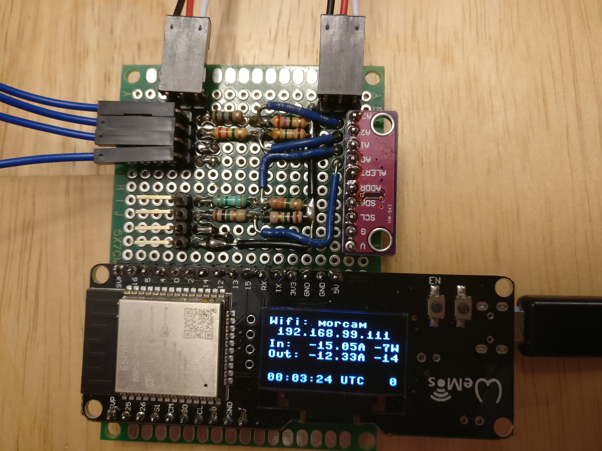
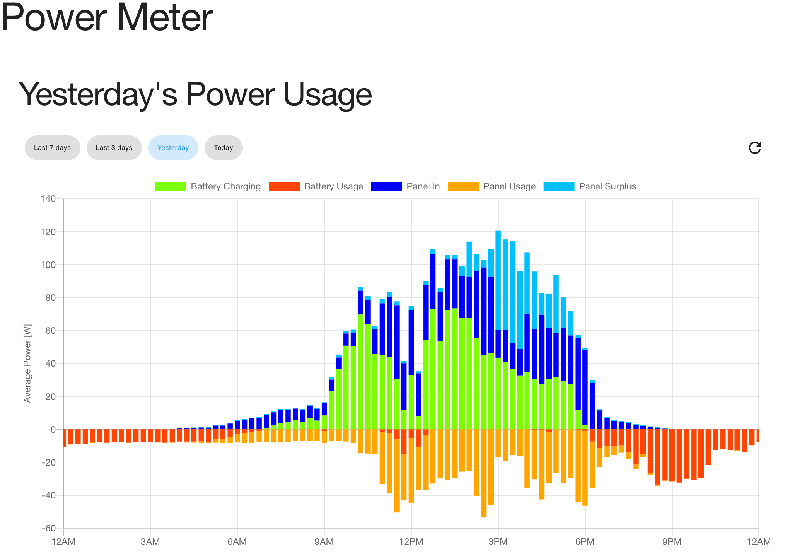
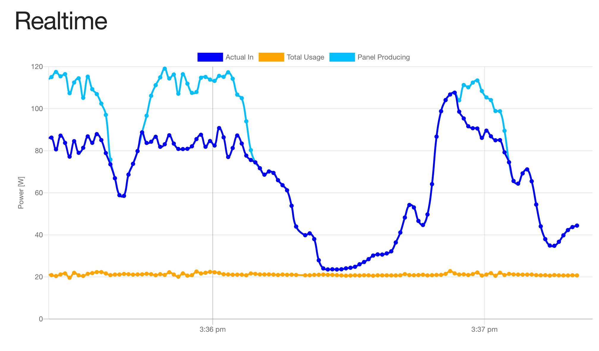

# power-meter esp32-micropython

## Software for an ESP32 based power meter with a small OLED display and Wifi. IoT!!!

A 0.96" OLED diplay allows showing the data. This allows both tracking instantaneous usage as well as how much more energy has been produced than used (or not!).
The flash storage built into the ESP32 allows recording around 7 days of data at a resolution of 20 seconds. Furthermore, the ESP32 serves a small web app so the data can be loaded and visualized in the web browser of a smartphone, tablet, or PC. Also, current data is fed to the web app in using websockets and graphed in realtime.

### Hardware

ESP32 with built in display. Uses external ADC to get high-resolution measurements from the current sensors. Same current sensors as the arduino-lcd variant.

### Screenshots

#### Historical Power:

#### Realtime Power:

### Software

[Svelte](https://svelte.dev/) and [Chart.js](https://www.chartjs.org/).

Total power produced by the solar panel is calculated and displayed for PWM (Pulse Width Modulation) charge controllers.

#### Configuration

Modify `server/settings.json` and `server/sensor_config.json` as per your wifi preferences (ex. AP or station) and sensor specs.

#### Setup

Flash the ESP32 with Micropython: https://micropython.org/download#esp32

To upload both the server and client code to the flash memory, you need rshell. Install Python, then the required packages:
`pip install -r requirements.txt`

To build and package the client code, you need node.js. Install that and do:
`npm install`

Then, update the makefile to match your serial port settings.

Finally, to update the ESP32 with the client and server code, do:
`make upload`

#### Development

To get a Python REPL on the ESP32, do:
`make repl`

This uses picocom, so to exit, do Ctrl+A then Ctrl+X.

To run the client code locally (helps speed up development), edit `.env.development` to point to the server and do:
`npm run start`

